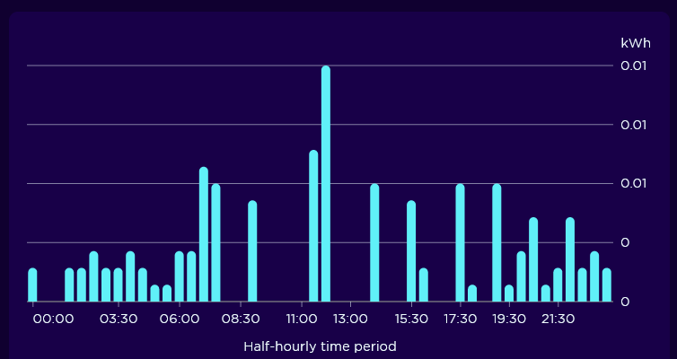
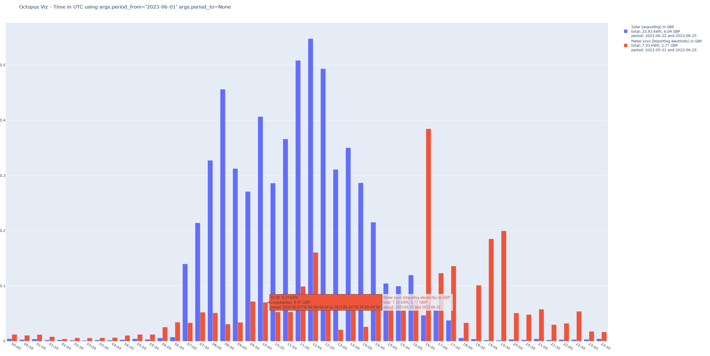
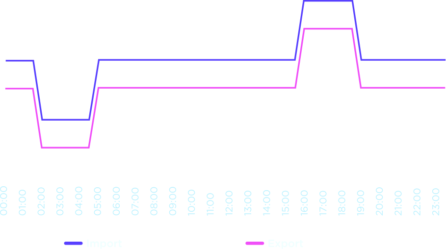

# !!! THIS IS A PROTOTYPE !!!

Now that you've been warned, let's continue.

# Octopus Viz [0.1.0]

The current Octopus App (v3.71.2 on Android) does not allow visualisation:
- of monetary value when using the Flux tariff
- of visualising aggregated data for a longer period than 1 day at the half hour rate.

The goal of this project is to:
- create a cache of the electric consumption of a given system
- query said cache to map it to prices
  - to visualise the price of import for a period
  - to visualise the price of export per a period
  - to visualise the usage by half-hour aggregates over longer periods than 1 day

Octopus Energy API documentation: https://developer.octopus.energy/docs/api/
Octopus Energy Developer Dashboard: https://octopus.energy/dashboard/developer/

## Why a cache?

The Octopus API allows the gathering of data at the half-hour precision with a maximum of 25,000 entries per page (`2 * 24 * 365 = 17,520` so more than enough to see 1 year of half-hour data).

By using a cache for that data we:
- do not need to use their API for the visualisation part
- do not risk to get rate-limited if querying multiple time (I'm not sure if any rate limitation applies)

So the cache is lower priority.

## Configuration

The configuration files can be stored in `configs/` as it is part of the `.gitignore`.

The format is JSON and should contain:
- meters: list of `dto.Meter`
- tariffs: list of `dto.Tariff`

Example config for electricity:
```json
{
  "meters": {
    "api_key": "<api key>",
    "serial": "<meter serial>",
    "meters": [
      {
        "mpan": "<exporting mpan>",
        "unit": "electricity_exporting_kwh"
      },
      {
        "mpan": "<importing mpan>",
        "unit": "electricity_importing_kwh"
      }
    ]
  },
  "tariffs": {
    "flux_export_2023-07": {
      "unit": "electricity_exporting_kwh",
      "currency": "GBP",
      "rates": [
        {
          "interval_start": "00:00",
          "interval_end": "02:00",
          "rate": 0.1972
        },
        {
          "interval_start": "02:00",
          "interval_end": "05:00",
          "rate": 0.07432
        },
        {
          "interval_start": "05:00",
          "interval_end": "16:00",
          "rate": 0.1972
        },
        {
          "interval_start": "16:00",
          "interval_end": "19:00",
          "rate": 0.32008
        },
        {
          "interval_start": "19:00",
          "interval_end": "24:00",
          "rate": 0.1972
        }
      ]
    },
    "flux_import_2023-07": {
      "unit": "electricity_importing_kwh",
      "currency": "GBP",
      "rates": [
        {
          "interval_start": "00:00",
          "interval_end": "02:00",
          "rate": 0.30720
        },
        {
          "interval_start": "02:00",
          "interval_end": "05:00",
          "rate": 0.18432
        },
        {
          "interval_start": "05:00",
          "interval_end": "16:00",
          "rate": 0.30720
        },
        {
          "interval_start": "16:00",
          "interval_end": "19:00",
          "rate": 0.43008
        },
        {
          "interval_start": "19:00",
          "interval_end": "24:00",
          "rate": 0.30720
        }
      ]
    }
  }
}
```

The objects are loaded from the configuration JSON with their `from_dict` factory, a trick is applied so that 
fields don't have to be repeated:
```json
{
  "meters": {
    "api_key": "<api key>",
    "serial": "<meter serial>",
    "meters": [
      {
        "mpan": "<exporting mpan>",
        "unit": "electricity_exporting_kwh"
      },
      {
        "mpan": "<importing mpan>",
        "unit": "electricity_importing_kwh"
      }
    ]
  }
}
```
will create:
```json
[
  {
    "api_key": "<api key>",
    "serial": "<meter serial>",
    "mpan": "<exporting mpan>",
    "unit": "electricity_exporting_kwh"
  },
  {
    "api_key": "<api key>",
    "serial": "<meter serial>",
    "mpan": "<importing mpan>",
    "unit": "electricity_importing_kwh"
  }
]
```

The `dto.Tariff` has an optional `valid_from`, `valid_until` range that can be used when tariffs are updated.

## Visualisation with `octopus-viz`

The current Octopus App or website allow the visualisation of a day:



But this project should allow to have this view over longer periods of time than a day still accumulating at the half-hour interval.

```bash
$> octopus-viz configs/elec_config.json -o rendered.html --show-price --period-from 2023-06-01
```

- `configs/elec_config.json` to load the configuration
- `-o rendered.html` to save the results to an HTML file that can be opened with a browser later
- `--show-price` to have the graph show the prices, otherwise they will show consumption
- `--period-from 2023-06-01` respecting the format of the Octopus API



Use `--help` to know more.

## Data in the command line with `octopus-raw-usage`

This project also include a "raw" visualisation (it will probably be extended to export to JSON or CSV)

It's fairly unreadable but is easy to use to test configuration files. It shows the "top n" (which is 5) time periods
with high and low consumption/generation.

```bash
$> octopus-raw-usage configs/elec_config.json --aggregate-format '%H:00'
```
```
INFO:octopus_viz.octopus_client:Loading configuration from "configs/elec_config.json"
INFO:octopus_viz.octopus_client:Loaded 2 configs and 4 tariffs from "configs/elec_config.json"
INFO:octopus_viz.octopus_client:Getting data for meter.serial='xxxx' for period_from=None period_to=None
INFO:octopus_viz.octopus_client:Gathered 2 pages of data for meter.serial='xxxx' for period_from=None period_to=None
Generation for Solar (exporting) 2023-06-22 00:00:00+00:00 <= UTC < 2023-06-25 00:00:00+00:00
top_consumption={'4.529', '3.408', '3.014', '3.805', '2.877'}
bottom_consumption={'0.027', '0.016', '0.026'}
00:00: 0.031kWh 0.01 GBP
01:00: 0.026kWh 0.01 GBP <= LOW GENERATION
(...)
10:00: 3.014kWh 0.69 GBP <= HIGH GENERATION
11:00: 3.805kWh 0.87 GBP <= HIGH GENERATION
12:00: 4.529kWh 1.04 GBP <= HIGH GENERATION
13:00: 2.877kWh 0.66 GBP <= HIGH GENERATION
(...)
23:00: 0.033kWh 0.01 GBP
Total generation for Solar (exporting) 2023-06-22 00:00:00+00:00 <= UTC < 2023-06-25 00:00:00+00:00 is 25.926kWh 6.04 GBP
INFO:octopus_viz.octopus_client:Getting data for meter.serial='xxxx' for period_from=None period_to=None
INFO:octopus_viz.octopus_client:Gathered 37 pages of data for meter.serial='xxxx' for period_from=None period_to=None
Consumption for Meter xxxx (importing electricity) 2023-04-09 23:30:00+00:00 <= UTC < 2023-06-25 00:00:00+00:00
top_consumption={'2.335', '1.553', '1.830', '2.486', '2.100'}
bottom_consumption={'0.197', '0.232', '0.289', '0.382', '0.206'}
00:00: 0.588kWh 0.20 GBP
01:00: 0.197kWh 0.07 GBP <= LOW CONSUMPTION
(...)
23:00: 2.486kWh 0.84 GBP <= HIGH CONSUMPTION
Total consumption for Meter xxxx (importing electricity) 2023-04-09 23:30:00+00:00 <= UTC < 2023-06-25 00:00:00+00:00 is 24.754kWh 8.99 GBP

```

## Note: Octopus Flux

Source: https://octopus.energy/smart/flux/

Is a tariff with 3 levels of price for import and export:
- 1 base price during most of the day, usually slightly lower than the national average.
- 1 low price at the early hours (02:00 to 05:00)
- 1 high price at the peak hours (16:00 to 19:00)
 

